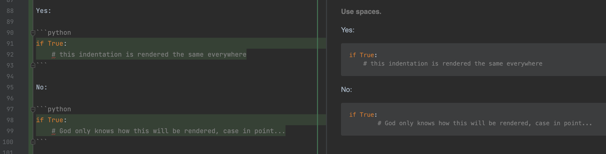

# Omni-Language Code Style

A collection of rules I follow when styling my code. This is a work in progress.

# Interpretation

Rules and motivations are written in priority order. Ideally everything will be satisfied. However,
there will come times when you need to violate some to satisfy others. When that happens, satsify
the ones higher up the list.

# Glossary

These are definitions of terms I will use to define the rules.

- attached (same line) : two entities have 0 spaces between them
- attached (different lines) : two entities have 0 extra newlines between them
- block : a scope constrained level of code (e.g. loops, if-else branches)
- detached (same line) : two entities have exactly 1 space between them
- detached (different lines) : two entities have exactly 1 empty line between them
- enclosure : any pair of characters that open and close (e.g. `[` and `]`, `<` and `>`, etc.)
- inner level : the indentation level within a block
- outer level : the indentation level a block starts on

# Motivations

These are the outcomes that the rules are helping achieve.

1. Maintainers can read the code.
2. Maintainers can update the code.
3. Community members can read the code.
4. Community members can update the code.
5. Lay programmers can read the code.
6. Lay programmers can update the code.

# Rules

###### Do what most maintainers agree upon weighted by expected contribution.

Maintainers who are expected to contribute more get proportionally more say. Only expected
maintenance is taken into account, not past maintenance. If a project has one maintainer that wrote
99% of the code and then decides to stop maintaining the code, their expected contribution is zero.

###### Do what the community is already doing.

Following along with what the community has already established is a great way to attract
participation from the community.

###### Blocks are attached to code at the inner level.

Yes:

```python
if True:
    pass
```

No:

```python
if True:

    pass
```

###### Blocks are detached from code at the outer level.

Yes:

```python
before = ()

if True:
    pass

after = ()
```

No:

```python
before = ()
if True:
    pass
after = ()
```

###### Comments come before the commented code.

Yes:

```python
# does the first thing
first = ()
```

No:

```python
first = ()
# does the first thing
```

###### Enclosures are closed on the level they are opened.

Yes:

```python
first = [
    second,
    third,
]
```

No:

```python
first = [
    second,
    third]
```

###### Enclosures opened on the same line are closed on the same line.

Yes:

```python
first = [second(
    third
)]
```

No:

```python
first = [second(
    third
)
]
```

###### Comments are detached from the previous code at the same level.

Yes:

```python
first = ()

# does the second thing
second = ()
```

No:

```python
first = ()
# does the second thing
second = ()
```

###### Comments for one line of code are attached.

Yes:

```python
# does the first thing
first = ()

second = ()
```

No:

```python
# does the first thing

first = ()

second = ()
```

###### Comments for multiple lines of code are detached.

Yes:

```python
# does the first thing then the second thing

first = ()
second = ()
```

No:

```python
# does the first thing then the second thing
first = ()
second = ()
```

###### Commented lines of code are detached from the following code.

Yes:

```python
# does the first thing
first = ()

second = ()

# does the first thing then the second thing

first = ()
second = ()

third = ()
```

No:

```python
# does the first thing
first = ()
second = ()

# does the first thing then the second thing

first = ()
second = ()
third = ()
```

###### File ends with exactly 1 newline.

###### Use spaces.

Yes:

```python
if True:
    # this indentation is rendered the same everywhere
```

No:

```python
if True:
	# God only knows how this will be rendered, case in point...
```


